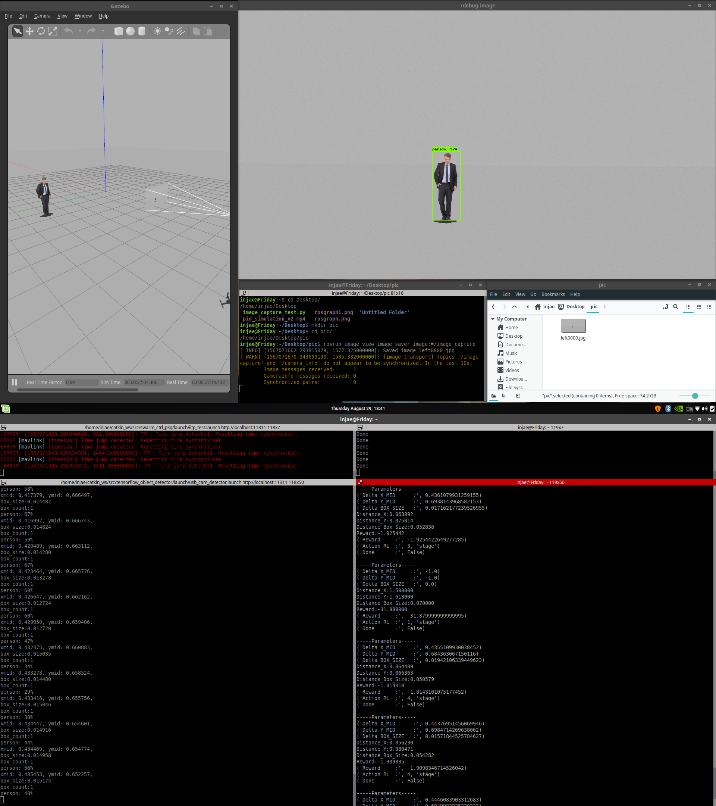
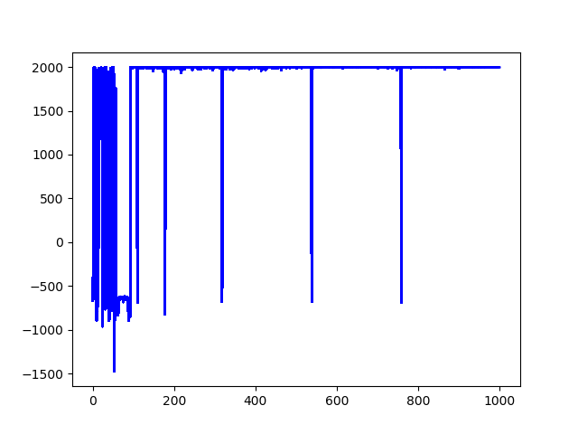
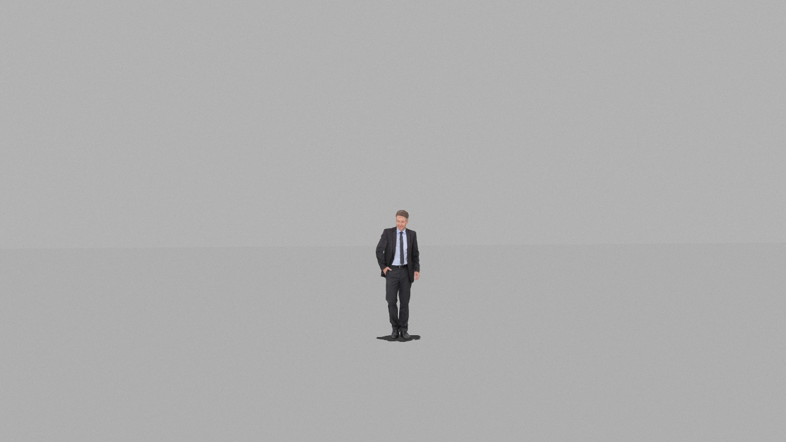

# Reinforcement Selfie Drone 시뮬레이션 및 학습
## 0. 시작 환경
- ssd_people_detector_ros 설치
  
        (참고 github)  https://github.com/HY-HIGH/ssd_people_detector_ros 
- RSD 설치
    >~$ git clone https://github.com/HY-HIGH/RSD    
- PID 제어 설치 
    >~$ git clone https://github.com/sewoongmin/Selfie_Drone.git
- Firmware 설치 , swarm_ctrl_pkg 설치
          
        (참고 github) https://github.com/ICSL-hanyang/drone_base 
      

---
## 1. 환경 설정
>~$ gedit ~/.bashrc

- 다음 내용을 추가
```sh
    #RSD 실행 단축키
    alias at='source ~/tensorflow/bin/activate'
    alias rlcapture='rosrun image_view image_saver image:=/image_capture'
    alias rsd='rosrun RSD DQNAgent.py'
    alias rlworld='roslaunch swarm_ctrl_pkg iitp_test.launch' #시뮬레이션 환경
    alias rlpid='roslaunch selfie_drone selfie.launch' #PID제어
    alias rlssd='roslaunch ssd_people_detector_ros usb_cam_detector.launch'        
        #ssd_people_detector_ros실행

    #gedit .bashrc
    alias sb='source ~/.bashrc'
    alias eb='gedit ~/.bashrc'

    #ROS Control
    alias sb='source ~/.bashrc'
    alias eb='gedit ~/.bashrc'
    alias cw='cd ~/catkin_ws'
    alias cs='cd ~/catkin_ws/src'
    alias cm='cd ~/catkin_ws && catkin_make'

    #ROS Drone Control
    alias goto='rosservice call /multi_setpoint_local -- POINT'
    alias offboard='rostopic pub /multi/set_mode std_msgs/String "offboard"'
    alias land='rostopic pub /multi/set_mode std_msgs/String "auto.land"'
    alias arm='rostopic pub /multi/arming std_msgs/Bool 1'
    alias disarm='rostopic pub /multi/arming std_msgs/Bool 0'

    #기타 의존성
    source  /opt/ros/melodic/setup.bash
    source ~/catkin_ws/devel/setup.bash
    source ~/Firmware/Tools/setup_gazebo.bash ~/Firmware ~/Firmware/build/posix_sitl_default
    export ROS_PACKAGE_PATH=$ROS_PACKAGE_PATH:~/Firmware
    export ROS_PACKAGE_PATH=$ROS_PACKAGE_PATH:~/Firmware/Tools/sitl_gazebo

```
---------
## 2. 학습 실행 과정
- 터미네이터 사용 추천
- 터미널창 4개 이용  
    - 1~4번 터미널
        >~$ at  
          
            tenserflow 가상환경 실행
    - 1번 터미널
        >~$ rlworld     

            GAZEBO 가상 시뮬레이션 실행   

    - 2번 터미널  

        >~$ rlssd    

            ssd_people_detector_ros 실행

    - 3번 터미널  
        >~$ cd /{목표위치 도달후 찍은사진 저장할 디렉토리}  
        >~$ rlcapture  
          
            목표위치 도달후 캡쳐한 사진을 저장
            저장시에 기록이 남는다.
    - 4번 터미널  
        >~$ goto 0 0 2    
          
            ctrl+c 를 눌러 다음 커맨드를 입력한다.

        >~$ arm  
          
            ctrl+c 를 눌러 다음 커맨드를 입력한다.

        >~$ offboard      
              
            드론이 0 0 2 위치로 이동하는것을 확인후
            ctrl+c 를 눌러 다음 커맨드를 입력한다.
          
            
        >~$ rsd  
          
        **강화 학습 Agent 실행 및 강화 학습 시작**
 ---
## 3. 학습
### 학습모습은 다음과 같다. 




---
## 4.학습 종료
### 코드에서 지정해준 episode 까지 진행 후 종료된다.
>~$ cd src/save_graph   
  
- 각 구간별 그래프와 최종 그래프가 저장된다.
    
>~$ cd src/save_model 
- 각 구간별 모델과 최종 모델이 저장된다. 

>~$ cd /{목표위치 도달후 찍은사진 저장할 디렉토리}  
  - 목표위치 도달후 찍은 사진이 저장된다.
  


